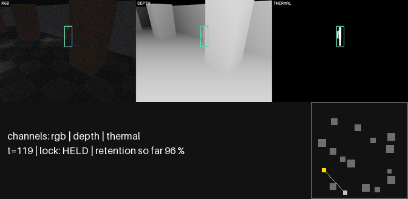
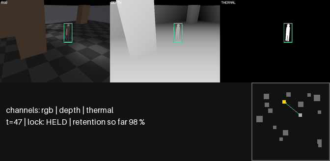
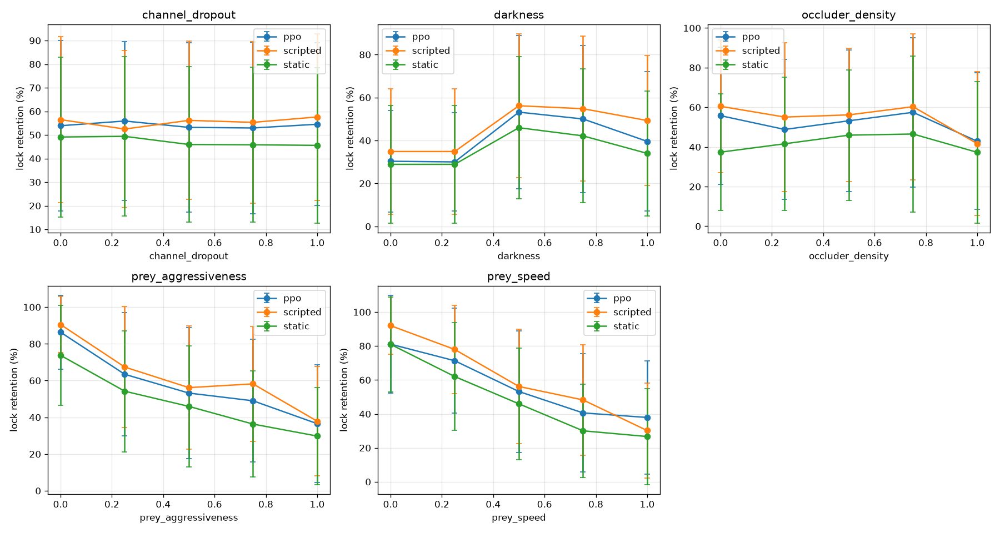

# lockon — active perception under degradation

A simulated drone camera that **moves to keep lock on a person who is actively hiding** — behind
pillars, in the dark, when a sensor dies. Everything runs inside a MuJoCo arena the repo owns: no
real footage, no datasets, no learned detector. The demo is the product.

Use cases this is built for: drone safety, search and rescue, autonomous filming, wildlife
monitoring. Nothing here transfers to real hardware; it is a simulation study.

| Person ducks behind a pillar → the camera repositions → lock survives | Lights cut → the colour channel goes to noise → the thermal proxy takes over |
|---|---|
|  |  |

Panels: colour · depth · thermal proxy, tracker box + id on every live channel, banner with lock
state and running **lock retention %**, top-down minimap (green line = line of sight).

## The one number: lock retention %

`retention = steps on which the tracker outputs a track carrying the target's FIRST id with
IoU ≥ 0.5 to the true box ÷ episode steps` (`lockon.core.metrics`). An id switch is a loss even
if some other track still overlaps — that is the whole point. Secondary: time-to-reacquire.

Every number below is regenerated from `reports/eval_*.json` by `scripts/readme_table.py`:

| camera policy | lock retention % | ± std | 95 % CI of mean | Δ vs static (95 % CI) | time-to-reacquire |
|---|---|---|---|---|---|
| static camera (floor) | 44.0 | 32.1 | [36.9, 51.0] | — | 1.66 |
| scripted hunter (visibility-greedy) | 52.0 | 33.8 | [44.6, 59.4] | +8.0 [+2.3, +13.7] | 2.09 |
| PPO hunter (best local checkpoint) | 51.3 | 35.1 | [43.6, 59.0] | +7.3 [+1.1, +13.5] | 1.70 |

n = 80 episodes per arm, seeds 1000–1079 (held out from model selection), mid difficulty (every
dial 0.5), tracker noise dial 0.3, per-episode noise seed. **Moving beats standing still:** both
hunters clear the static floor by about 8 points with confidence intervals that exclude zero.
**Learning does not beat the script:** scripted − PPO is +0.7 points, CI [−5.1, +6.5], so the two
are indistinguishable and neither is better by more than ~6 points. The hero policy is therefore
the **scripted hunter**; the PPO result is reported as it is.

Degradation curves — retention vs occluder density · darkness · prey speed · prey aggressiveness
· channel dropout, mean ± std over 20 episodes per point, one axis at a time with the others at
0.5 — from one command (`python -m lockon.harness.sweep --config configs/sweep_local.yaml`):



`reports/sweep/failure_report.md` names the worst point and the dominant loss cause per axis. Across
all 1,500 sweep episodes every lock loss is attributed to occlusion or field-of-view, never to
darkness or channel dropout: with a dark-immune thermal proxy and at most one dead channel at a
time, those two axes cannot break lock on their own (a design statement, now also a measurement).

## An evader trained to break the lock (PERUN, one H200)

A second PPO agent was trained as the **prey** — privileged observations, rewarded for being
unseen — against the frozen scripted hunter, 20M steps on one H200. Every camera policy was then
scored against both prey on the same held-out seeds (n = 80, seeds 1000–1079, mid difficulty):

| hunter | vs scripted prey | vs learned prey | Δ | median vs learned |
|---|---|---|---|---|
| static camera | 44.0 ± 32.1 | 27.6 ± 28.1 | −16.4 | — |
| scripted hunter | 52.0 ± 33.8 | 50.8 ± 39.0 | −1.2 | 39.5 (from 45.3) |
| PPO hunter | 51.3 ± 35.1 | 35.9 ± 31.3 | −15.4 | — |

The comparison that carries weight is the **interaction**, paired by seed: the scripted hunter
gives up 14.2 points less than the PPO hunter under the same evader, CI [+5.1, +23.9], and 15.2
points less than the static camera, CI [+5.9, +24.7]. Per-arm intervals overlapping zero would
*not* have established this; the paired difference-in-differences does.

**What the evader actually learned was to leave the frame, not to hide.** Against the two policies
it degrades, field-of-view losses rise (static 47→63, PPO 10→29) and time-to-reacquire nearly
doubles; against the scripted hunter, FOV losses *fall* (64→44) and reacquisition gets *faster*.
A controller that chases re-centres the target; a fixed camera cannot, and the learned hunter
does so poorly.

Three caveats, all measured:

- **The evader plateaued after 2M of its 20M steps** (37 later evaluations, mean 50.3 ± 3.2, trend
  slightly *upward*). Its published checkpoint is the minimum of that noisy plateau, −1.9σ, and it
  regressed to the plateau on held-out seeds exactly as selection noise predicts. Against its own
  training opponent it never beat the hand-written prey (plateau 53.2 vs scripted prey 54.3). So
  this is evidence that *this* evader is weak against active pursuit — not that the scripted
  hunter is robust to adversaries in general.
- **Its reward paid on geometric visibility, not on tracker lock** — the same proxy divergence
  already logged for the hunter (deviation row 8), so the optimiser had no gradient on the number
  being reported. A corrected run is in flight.
- **The scripted prey it is compared against is speed-handicapped**: it wanders at half speed when
  not actively evading and realises 69 % of the speed cap, while the learned prey may use all of
  it. Part of the −16.4 and −15.4 is that handicap, not evasion skill.

Full table and per-episode data: `reports/prey_trial.md`, `reports/eval_*.json`. Both policies
in these tables are published under `models/` so every number can be recomputed.

## How it works (7 packages, each standalone)

```
core     typed schemas + the retention metric (numpy only)
env      MuJoCo arena: pillars, point lights, a kinematic drone camera (velocity commands,
         fixed altitude, first-order response), a capsule humanoid; line of sight via mj_ray;
         the true 2D box is projected from state — no render in the loop
sensor   colour / depth / thermal-proxy render passes, channel registry, dead-channel flags
track    noisy-GT boxes (miss, jitter, range dropout, 1-step latency) → ByteTrack → lock status
policy   scripted prey (cover-seek, dark-seek, LOS-break, speed dials) · scripted hunter ·
         PPO hunter (Stable-Baselines3, state observations only, CPU)
harness  episode runner, Gymnasium wrapper, train / eval / sweep / render CLIs
demo     three shots + Gradio viewer (static HTML fallback)
```

Design law: **nothing outside our control in the critical path.** The tracker consumes the
simulator's own true boxes plus injected noise, so it can never fail for a reason we cannot fix.
RL trains on state (own pose, last-seen target pose, time since seen, 16 raycasts, light level
at the last sighting, channel-alive flags; 4-frame stack), never on pixels; rendering exists for
clips only. The reward is the frozen tracker's lock, run inside the training loop at state speed.
"Thermal" is a **thermal proxy**: a second render pass with an emissive target material,
unaffected by light level.

## Where it breaks (honest list — every line traces to `reports/deviation-log.md` or a JSON)

- **Coasting through occlusion is a lottery.** ByteTrack's image-space Kalman keeps the id across
  a 2 s gap in 16 of 20 noise seeds at noise dial 0.3, flat in box speed and state model
  (row 6). The hunter's job is to keep gaps short.
- **Moving cameras pay a latency tax.** The noise model delivers boxes one step late at dial
  0.3; retention scores against the current box, so the faster the box moves in the image, the
  lower the IoU. The static floor is exempt by construction.
- **Darkness alone never breaks lock**: the thermal proxy is dark-immune, so the darkness curve
  is flat-to-rising. It rises because the scripted prey blends dark-seeking with cover-seeking
  above darkness 0.3 and hides behind pillars less — a property of the examiner, stated here.
- **The prey examines movers harder than the floor.** Disabling its line-of-sight break widens the
  scripted-vs-static gap from +10.2 to +16.8 points (`reports/los_break_bias.json`): the shipped
  comparison is conservative for the hunters by ≈ 6.5 points.
- **Reward ≠ visibility.** A policy rewarded for raw visibility learned to strafe and yaw so hard
  that boxes jumped ~8 px/step and the tracker switched ids 5.6× per episode — visibility up,
  retention down (row 8). Exploration noise above std ≈ 0.2 pushes the target out of the field
  of view (row 9). Letting the policy observe the tracker's lock instead of geometry (row 12)
  made it worse on held-out seeds (row 13). Three local PPO designs; one passes the floor, none
  beats the scripted hunter.
- **The learned policy never beat the script, and degrades faster under pressure.** Under the
  learned evader the PPO hunter gives up 14.2 points more than the scripted one (paired CI
  [+5.1, +23.9]) — though see the three caveats on that trial above. Five local training runs (three of them
  instrument-defective and diagnosed as such) and a 45-unit HPC sweep over seeds, reward
  variants and arena densities; the best PPO hunter ties the hand-written one. What PPO does
  buy is a faster reacquisition (1.70 vs 2.09 steps) at the same retention.

## Compute

Everything demo-facing runs on a laptop; the cluster work is a sweep, not a requirement.

| where | what | cost |
|---|---|---|
| RTX 4060 laptop, CPU | all seven packages, five local PPO runs, the degradation sweep (1 500 episodes), every clip | state-only PPO at ~2.9k env steps/s; a 6M-step run is ~35 min |
| TUKE PERUN, cpu_short | 45-unit sweep: 5 seeds × 3 reward variants × 3 arena densities, 6M steps each | ~50 CPU-h, 0 GPU-h |
| TUKE PERUN, gpu_short (H200) | learned-prey trial, 20M steps, plus the curve/clip render pass | ~2.3 GPU-h, ~8k env steps/s |

State-only PPO is CPU-optimal (a two-layer MLP over a 26-dim observation), so the array asks for
no GPU at all. The GPU earns its place on the prey trial's throughput and on EGL offscreen
rendering. Reproduce the cluster side with `HPC_RUNBOOK.md`; the job scripts are emitted from
`configs/hpc_sweep.yaml` and carry their own budget table.

## Run it

```bash
uv sync                                                # Python 3.11, per-project venv
uv run python scripts/check_gates.py --all             # every gate, verdicts -> reports/gates.json
uv run python -m lockon.harness.eval --policy scripted --vs static --n 20 --seed-base 1000
uv run python -m lockon.harness.sweep --config configs/sweep_local.yaml --workers 6
uv run python -m lockon.harness.train --config configs/ppo_local.yaml --out runs/ppo_local
uv run python -m lockon.demo.render_all --policy scripted && uv run python -m lockon.demo.viewer
```

Windows 11 + GLFW offscreen rendering is the dev target; Linux uses EGL or OSMesa
(`MUJOCO_GL`). State-only PPO trains on CPU by design (~2.9k env steps/s on a laptop; 6M steps
≈ 35 min). The sweep is memory-bound: keep `--workers` ≤ 6 on 16 GB.

## Licences

Apache-2.0. Dependencies are Apache/MIT/BSD only (`THIRD_PARTY.md`); no datasets, no weights.
A guard test (`tests/test_license_guard.py`) classifies every committed visual and rejects
untracked source files and anchored-ignore mistakes.
